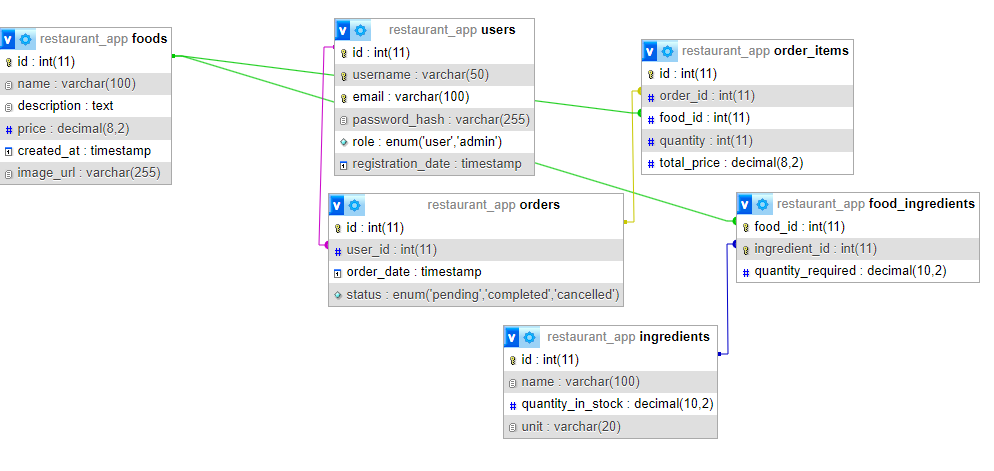

# Étterem Asztali Alkalmazás

## Projekt Leírása

Ez az alkalmazás egy étterem asztali felülete, ahol a felhasználók regisztrálhatnak, bejelentkezhetnek, és ételeket rendelhetnek. Az adminisztrátorok kezelhetik az ételek és azok alapanyagainak készletét, frissíthetik a raktárkészletet, és levonhatják az alapanyagokat a rendelések végrehajtásakor.

## Funkciók

### 1. Felhasználói Regisztráció és Bejelentkezés
- A felhasználók regisztrálhatnak és beléphetnek az alkalmazásba.
- A felhasználói adatokat adatbázisban tároljuk biztonságosan.


### 2. Ételrendelés
- A felhasználók böngészhetik az elérhető ételeket.
- Az ételek részletes leírást tartalmaznak, beleértve az alapanyagokat és azok mennyiségét.
- A felhasználók kosárba helyezhetik az ételeket, megadhatják a kívánt mennyiséget, és leadhatják a rendelést.


### 3. Alapanyag Kezelés (Adminisztrátor Funkció)
- Az adminisztrátorok új alapanyagokat adhatnak hozzá, módosíthatják vagy törölhetik a meglévőket.
- A raktári készlet aktuális állapota nyomon követhető és frissíthető.


### 4. Rendelés Végrehajtása és Készlet Levonás
- A rendelések leadásakor az étel alapanyagainak megfelelő mennyisége automatikusan levonásra kerül a raktárkészletből.
- Ha a készlet nem elegendő, a rendszer figyelmezteti a felhasználót, hogy az étel nem rendelhető.

## Fejlesztési Folyamat

### Csapat
Csapatunk neve: Besinkáztunk
A projektet Dankó Dániel és Vedrán Krisztián készítette.

### Agilitás
A fejlesztés során Trello-t használtunk a feladatok nyomon követésére.

### Verziókezelés
A kódbázis központi tárolására és a verziók nyomon követésére Git verziókezelőt használtunk.

### Adatbázis


## Telepítési Útmutató

1. **Követelmények**: Győződj meg róla, hogy a következő szoftverek telepítve vannak:
   - [.NET Framework](https://dotnet.microsoft.com/)
   - [SQLite](https://www.sqlite.org/)
   - [Git](https://git-scm.com/)

2. **Projekt Klónozása**:
   ```bash
   git clone https://github.com/felhasznalo/etterem-projekt.git
